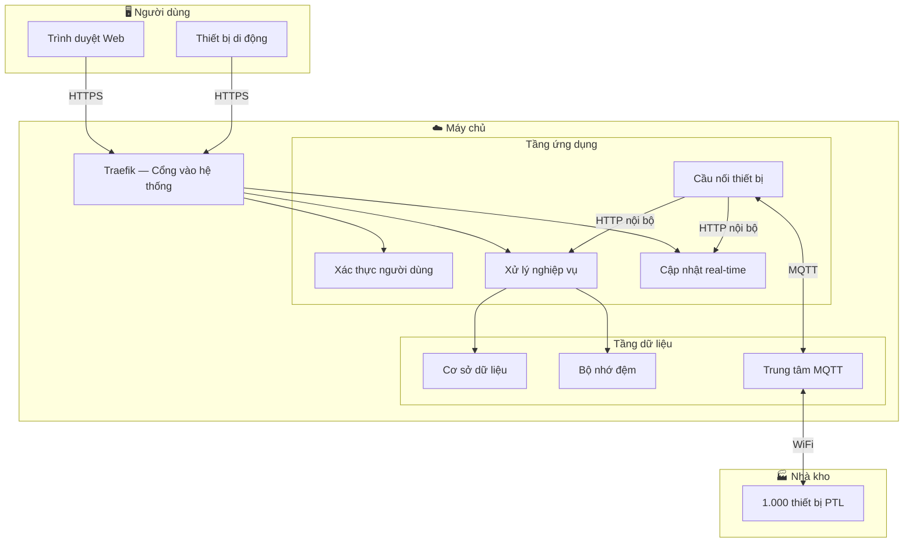
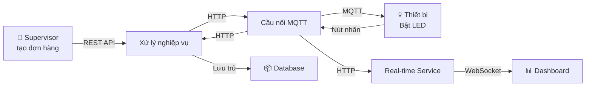
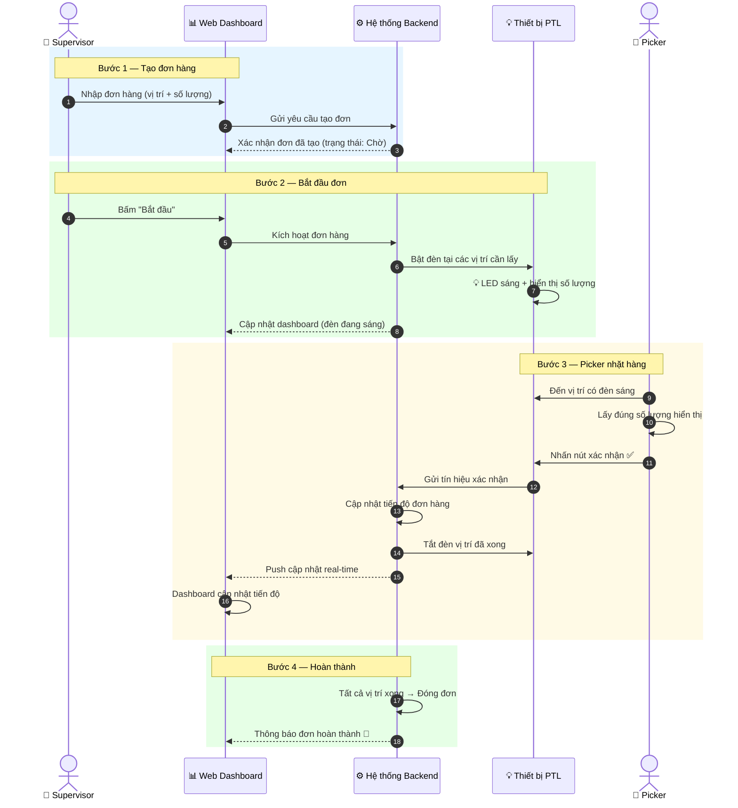
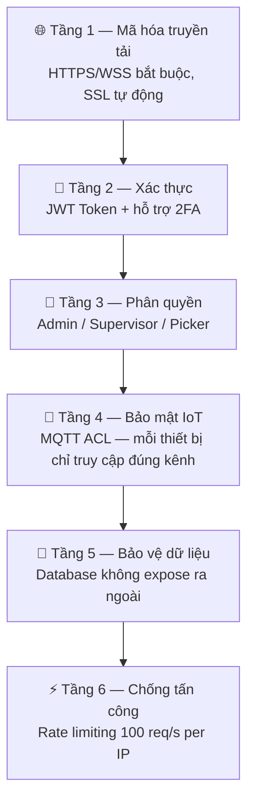
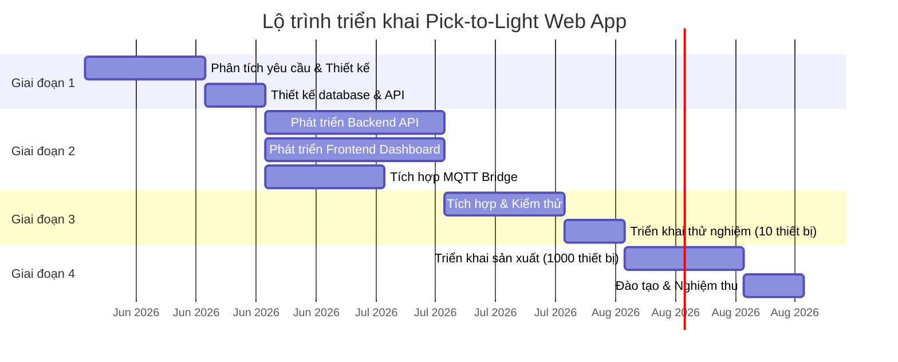
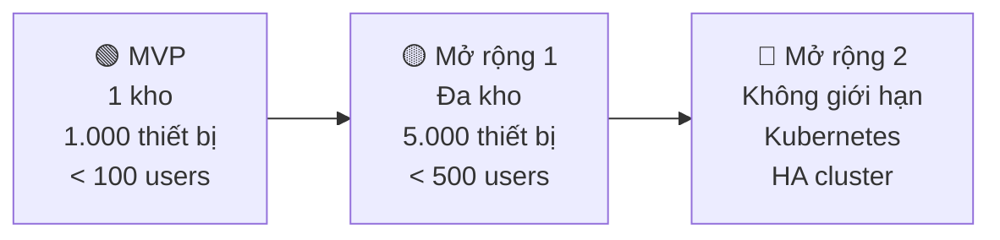

# 🏭 Giải Pháp Web App — Hệ Thống Pick-to-Light

> **Hệ thống quản lý kho thông minh — Điều khiển 1.000 thiết bị real-time**

---

## 📋 Mục lục

1. [Giới thiệu tổng quan](#1-giới-thiệu-tổng-quan)
2. [Vấn đề & Giải pháp](#2-vấn-đề--giải-pháp)
3. [Kiến trúc hệ thống](#3-kiến-trúc-hệ-thống)
4. [Tính năng Web App](#4-tính-năng-web-app)
5. [Luồng vận hành](#5-luồng-vận-hành)
6. [Công nghệ sử dụng](#6-công-nghệ-sử-dụng)
7. [Bảo mật](#7-bảo-mật)
8. [Lộ trình triển khai](#8-lộ-trình-triển-khai)
9. [Khả năng mở rộng](#9-khả-năng-mở-rộng)

---

## 1. Giới thiệu tổng quan

### Pick-to-Light là gì?

Pick-to-Light (PTL) là hệ thống hỗ trợ nhặt hàng trong kho, sử dụng **đèn LED và nút nhấn** gắn tại từng vị trí kệ hàng. Khi có đơn hàng, hệ thống **tự động bật đèn** tại các vị trí cần lấy hàng, nhân viên kho chỉ cần đến vị trí có đèn sáng, lấy đúng số lượng hiển thị, và nhấn nút xác nhận.

### Web App đóng vai trò gì?

Web App là **trung tâm điều khiển và giám sát** toàn bộ hệ thống:

| Vai trò | Mô tả |
|---------|-------|
| 🎛️ **Điều khiển** | Tạo đơn hàng, bật/tắt đèn, quản lý thiết bị |
| 📊 **Giám sát** | Theo dõi tiến độ đơn hàng, trạng thái thiết bị real-time |
| 📈 **Báo cáo** | Thống kê hiệu suất nhặt hàng, lịch sử hoạt động |
| 👥 **Quản lý** | Phân quyền người dùng, quản lý kho/zone |

---

## 2. Vấn đề & Giải pháp

### ❌ Vấn đề hiện tại (kho truyền thống)

| Vấn đề | Hệ quả |
|--------|--------|
| Nhặt hàng theo giấy / danh sách | Chậm, dễ sai vị trí |
| Không theo dõi real-time | Supervisor không biết tiến độ |
| Không có thống kê | Không biết nhân viên nào hiệu quả |
| Thiết bị lỗi không phát hiện | Mất thời gian xử lý |

### ✅ Giải pháp Pick-to-Light Web App

| Giải pháp | Lợi ích |
|-----------|---------|
| Đèn LED tự động hướng dẫn | Giảm **50-70%** thời gian tìm vị trí |
| Dashboard real-time | Supervisor giám sát mọi lúc, mọi nơi |
| Báo cáo tự động | Phân tích hiệu suất, tối ưu nhân sự |
| Cảnh báo thiết bị offline | Phát hiện lỗi ngay lập tức |

---

## 3. Kiến trúc hệ thống

### 3.1. Tổng quan kiến trúc

### 3.2. Luồng dữ liệu tổng quan

---

## 4. Tính năng Web App

### 4.1. Dashboard giám sát real-time

| Tính năng | Mô tả |
|-----------|-------|
| 🗺️ **Bản đồ kho** | Hiển thị grid 1.000 thiết bị theo zone, màu sắc theo trạng thái |
| 📊 **Tiến độ đơn hàng** | Thanh progress bar cập nhật tức thì khi picker xác nhận |
| 🟢 **Trạng thái thiết bị** | Online/offline, đèn đang bật/tắt, nhấp nháy |
| ⚡ **Cập nhật tức thì** | Không cần refresh trang — dữ liệu tự cập nhật qua WebSocket |

### 4.2. Quản lý đơn hàng

| Tính năng | Mô tả |
|-----------|-------|
| ➕ **Tạo đơn mới** | Nhập danh sách vị trí + số lượng cần lấy |
| ▶️ **Bắt đầu đơn** | Một nút bấm — tự động bật đèn tại tất cả vị trí |
| ⏸️ **Tạm dừng / Hủy** | Tắt đèn toàn bộ khi cần |
| 📋 **Lịch sử đơn** | Tra cứu, lọc theo ngày/trạng thái/kho |

### 4.3. Quản lý thiết bị

| Tính năng | Mô tả |
|-----------|-------|
| 📱 **Danh sách thiết bị** | Xem tất cả 1.000 thiết bị, lọc theo zone/trạng thái |
| 🔧 **Cấu hình** | Điều chỉnh độ sáng, màu LED, chế độ nhấp nháy |
| 🧪 **Test đèn** | Bật/tắt đèn thủ công để kiểm tra |
| ⚠️ **Cảnh báo offline** | Thông báo ngay khi thiết bị mất kết nối |

### 4.4. Quản lý kho & Zone

| Tính năng | Mô tả |
|-----------|-------|
| 🏢 **Đa kho** | Hỗ trợ nhiều kho, mỗi kho quản lý riêng |
| 📍 **Zone** | Chia kho thành các khu vực (zone) để dễ giám sát |
| 🗂️ **Vị trí kệ** | Gán thiết bị vào vị trí cụ thể (VD: Kệ A / Dãy 2 / Ô 05) |

### 4.5. Báo cáo & Thống kê

| Tính năng | Mô tả |
|-----------|-------|
| 📈 **Báo cáo ngày** | Số đơn hoàn thành, thời gian trung bình, tỉ lệ lỗi |
| 📊 **Hiệu suất zone** | So sánh throughput giữa các khu vực |
| 📋 **Lịch sử thiết bị** | Log hoạt động chi tiết từng thiết bị |

### 4.6. Phân quyền người dùng

| Vai trò | Quyền hạn |
|---------|-----------|
| 👑 **Admin** | Toàn quyền: quản lý user, thiết bị, cấu hình hệ thống |
| 👔 **Supervisor** | Tạo đơn, giám sát tiến độ, xem báo cáo |
| 👷 **Picker** | Xem task được giao (nếu dùng mobile app) |

---

## 5. Luồng vận hành

### 5.1. Quy trình nhặt hàng đầy đủ

### 5.2. Ví dụ thực tế

**Đơn hàng ORD-2026-0001** — Cần lấy hàng từ 2 vị trí:

| Bước | Hành động | Kết quả trên Dashboard |
|------|-----------|----------------------|
| 1 | Supervisor tạo đơn: Kệ A2-05 (3 cái), Kệ A2-08 (1 cái) | Đơn hiển thị trạng thái "Chờ" |
| 2 | Supervisor bấm "Bắt đầu" | 2 ô trên grid sáng xanh 🟢 |
| 3 | Picker đến A2-05, lấy 3 cái, nhấn nút | A2-05 chuyển ✅, tiến độ 50% |
| 4 | Picker đến A2-08, lấy 1 cái, nhấn nút | A2-08 chuyển ✅, tiến độ 100% 🎉 |

---

## 6. Công nghệ sử dụng

### 6.1. Bảng công nghệ

| Thành phần | Công nghệ | Vai trò |
|------------|-----------|---------|
| **Frontend** | Vue.js 3 + Vite | Giao diện web SPA, tương tác mượt mà |
| **Backend API** | Python FastAPI | Xử lý nghiệp vụ, REST API hiệu suất cao |
| **Real-time** | WebSocket | Cập nhật dashboard tức thì (< 100ms) |
| **IoT Protocol** | MQTT (EMQX Broker) | Giao tiếp với 1.000 thiết bị đồng thời |
| **Database** | PostgreSQL 16 | Lưu trữ dữ liệu chính, đáng tin cậy |
| **Cache** | Redis 7 | Bộ nhớ đệm trạng thái thiết bị, phản hồi nhanh |
| **API Gateway** | Traefik v3 | Phân luồng, SSL, bảo mật đầu vào |
| **Xác thực** | JWT + Authelia | Đăng nhập an toàn, phân quyền, hỗ trợ 2FA |
| **Giám sát** | Prometheus + Grafana | Theo dõi sức khỏe hệ thống 24/7 |
| **Log** | Loki + Promtail | Gom log tập trung, tra cứu nhanh |
| **Triển khai** | Docker Compose | Đóng gói, triển khai nhanh, dễ bảo trì |

### 6.2. Tại sao chọn stack này?

| Tiêu chí | Lựa chọn | Lý do |
|----------|----------|-------|
| **Mã nguồn mở** | Toàn bộ stack | Không tốn phí bản quyền, cộng đồng lớn |
| **Hiệu suất** | FastAPI + async | Xử lý hàng nghìn request/giây |
| **IoT chuyên dụng** | EMQX | Broker MQTT hàng đầu, hỗ trợ 10.000+ kết nối |
| **Triển khai dễ** | Docker | 1 lệnh khởi động toàn bộ hệ thống |
| **Bảo trì** | Microservices | Sửa 1 module không ảnh hưởng module khác |

---

## 7. Bảo mật

### 7.1. Các lớp bảo mật

### 7.2. Chi tiết bảo mật

| Lớp | Biện pháp |
|-----|-----------|
| **Truyền tải** | HTTPS bắt buộc, tự động chuyển HTTP → HTTPS |
| **Xác thực API** | JWT access token (15 phút) + refresh token (7 ngày) |
| **Dashboard nội bộ** | Authelia 2FA cho Grafana, EMQX (chỉ IT truy cập) |
| **MQTT** | Mỗi ESP32 chỉ gửi/nhận đúng topic của nó |
| **Database** | Nằm trong Docker network riêng, không truy cập từ ngoài |
| **Secrets** | Tất cả mật khẩu trong file `.env`, không hardcode |

---

## 8. Lộ trình triển khai

### 8.1. Timeline dự kiến

### 8.2. Chi tiết từng giai đoạn

| Giai đoạn | Thời gian | Nội dung | Kết quả |
|-----------|-----------|----------|---------|
| **GĐ 1** — Thiết kế | 3 tuần | Phân tích yêu cầu, thiết kế DB, API, wireframe UI | Tài liệu thiết kế hoàn chỉnh |
| **GĐ 2** — Phát triển | 3 tuần | Code backend, frontend, tích hợp MQTT | Phần mềm chạy được |
| **GĐ 3** — Kiểm thử | 3 tuần | Test hệ thống, thử nghiệm 10 thiết bị | Hệ thống ổn định |
| **GĐ 4** — Triển khai | 3 tuần | Lắp đặt 1.000 thiết bị, đào tạo, nghiệm thu | Hệ thống sản xuất |

> **Tổng thời gian dự kiến: ~12 tuần (3 tháng)**

---

## 9. Khả năng mở rộng

### 9.1. Lộ trình phát triển

### 9.2. Hệ thống được thiết kế để mở rộng

| Nhu cầu | Giải pháp |
|---------|-----------|
| Thêm kho mới | Tạo warehouse + zone trong hệ thống, không cần code mới |
| Thêm thiết bị | Đăng ký device qua API, plug & play |
| Nhiều user giám sát | WebSocket hỗ trợ hàng nghìn kết nối đồng thời |
| Tích hợp WMS/ERP | REST API chuẩn, hỗ trợ webhook |
| Mobile app cho Picker | API sẵn sàng, chỉ cần phát triển thêm frontend mobile |

---

## 📌 Thông số kỹ thuật cam kết

| Tiêu chí | Cam kết |
|----------|---------|
| Độ trễ điều khiển đèn | < **200ms** từ lúc bấm đến đèn phản hồi |
| Số thiết bị đồng thời | **1.000** nodes |
| Cập nhật dashboard | **Real-time** qua WebSocket (< 100ms) |
| Uptime hệ thống | > **99.5%** |
| Thời gian triển khai | **~12 tuần** |
| Hỗ trợ trình duyệt | Chrome, Edge, Firefox, Safari |
| Tương thích thiết bị | Desktop, Tablet, Mobile (responsive) |

---

## 📞 Liên hệ

Để được tư vấn chi tiết và demo hệ thống, vui lòng liên hệ:

- **Email:** [your-email@company.com]
- **Điện thoại:** [your-phone]
- **Website:** [your-website]

---

**Pick-to-Light Web App — Giải pháp kho thông minh**

*Nhanh hơn · Chính xác hơn · Minh bạch hơn*

